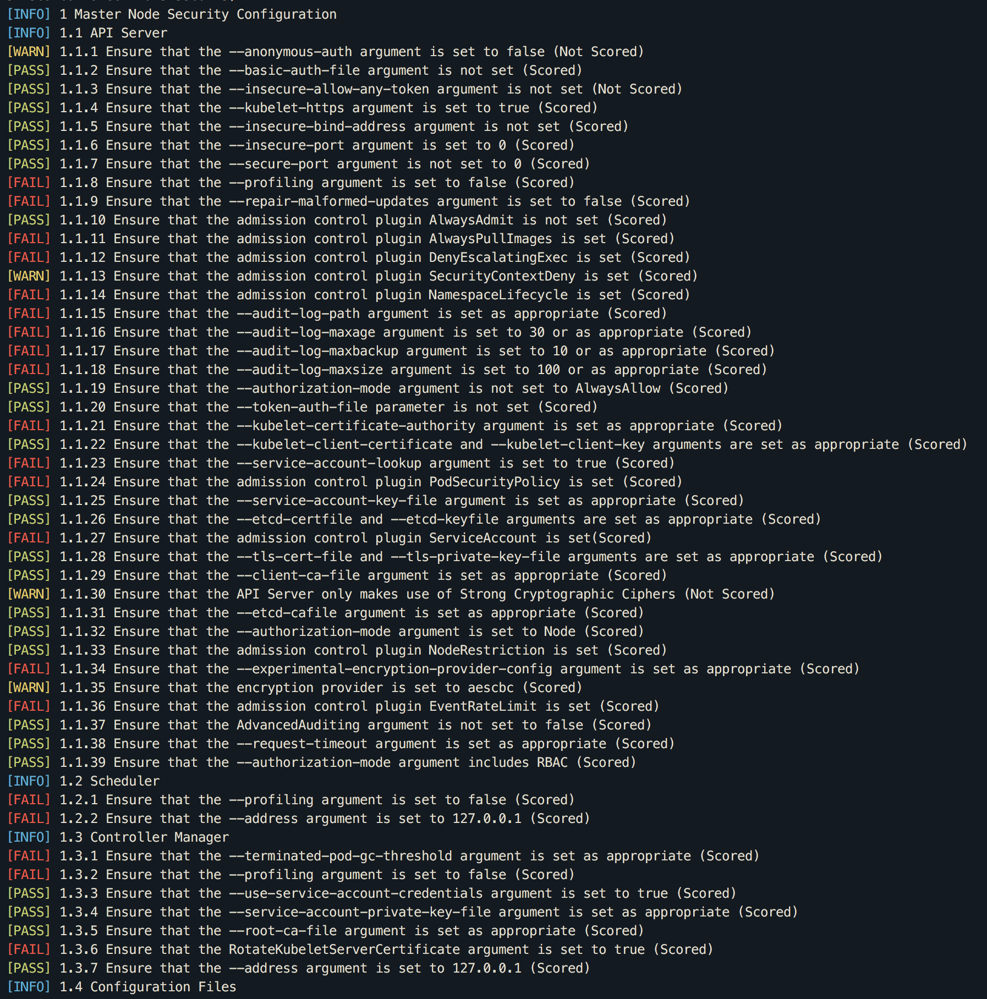

## Using `kube-bench`


### Provionning Kubernetes Cluster on scaleway

```
terraform apply \                                                                           
 -var region=par1 \
 -var arch=x86_64 \
 -var server_type=C2M \
 -var nodes=2 \
 -var server_type_node=C2M \
 -var weave_passwd=ChangeMe \
 -var docker_version=18.06 \
 -var ubuntu_version="Ubuntu Bionic"
 ```

> Only AMD version of servers will work . (arm ko)


### Installation  

```
git clone https://github.com/aquasecurity/kube-bench
```

### Access to Dashboard K8s

```
export KUBECONFIG=/Users/nabil/projects/trash/kube/provisioning/k8s-scw-baremetal/amd64.conf
kubectl -n kube-system port-forward deployment/kubernetes-dashboard 8888:9090
```

> http://localhost:8888

### Add Label

```
kubectl label node amd64-master-1 kubernetes.io/role=master
kubectl label node amd64-node-1 kubernetes.io/role=worker
kubectl label node amd64-node-2 kubernetes.io/role=worker
```

### Execute on Master

```
kubectl run --rm -i -t kube-bench-master --image=aquasec/kube-bench:latest --restart=Never --overrides="{ \"apiVersion\": \"v1\", \"spec\": { \"hostPID\": true, \"nodeSelector\": { \"kubernetes.io/role\": \"master\" }, \"tolerations\": [ { \"key\": \"node-role.kubernetes.io/master\", \"operator\": \"Exists\", \"effect\": \"NoSchedule\" } ] } }" -- master --version 1.13
```


### Execute on Node

```
kubectl run --rm -i -t kube-bench-master --image=aquasec/kube-bench:latest --restart=Never --overrides="{ \"apiVersion\": \"v1\", \"spec\": { \"hostPID\": true, \"nodeSelector\": { \"kubernetes.io/role\": \"worker\" } } }" -- node --version 1.13
```

### Results :




## Kube Hunter

```
conda create -n k8s_pentest
source activate k8s_pentest
git clone git@github.com:aquasecurity/kube-hunter.git
cd kube-hunter
pip install -r requirements.txt
```

### Run pentests inside Pod

```
kubectl create -f job.yaml
kubectl describe job kube-hunter
kubectl logs <pod name>
```

### Results inside Pods:


### Run Pentests BlackBox :

```
# Passive
./kube-hunter.py --remote 51.158.79.3
# Active
./kube-hunter.py --remote 51.158.79.3 --active
```
### Results Pentests Blackbox :


